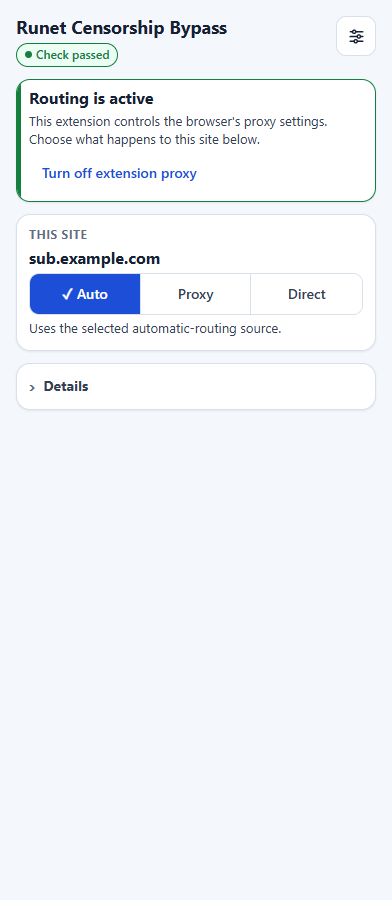
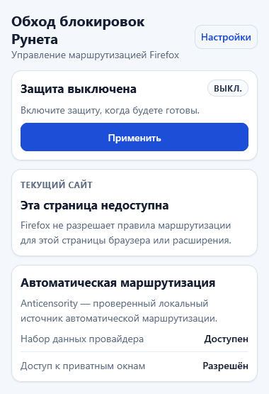

# Runet Censorship Bypass

Расширение выбирает, какие сайты открыть напрямую, а какие направить через
прокси. Для текущего сайта доступны три понятных режима: **Авто**, **Прокси** и
**Напрямую**. Поддерживаются Chromium MV3 и Firefox MV3.

Расширение не является VPN-сервисом и не выдаёт собственный прокси. Оно
применяет правила маршрутизации и использует подключения выбранного источника,
ваш прокси или запущенное локальное приложение.

[Скачать / Releases](https://github.com/aVitomin/runet-censorship-bypass-mv3/releases) ·
[Установка](docs/user/INSTALLATION.md) ·
[Первый запуск](#первый-запуск) ·
[Помощь](docs/user/TROUBLESHOOTING.md)

Этот README и руководства в `docs/user/` относятся к опубликованному
`0.0.4.0`. Сценарии ещё не выпущенной версии описаны отдельно в
[подготовке пользовательского руководства 1.0](docs/development/UPCOMING_1_0_USER_GUIDE.md).

## Что понадобится

Firefox требует версию **154.0 или новее**. Для Chromium в манифесте не задана
отдельная минимальная версия: нужен современный браузер с используемыми MV3 API.

Опубликованный выпуск `0.0.4.0` проверен в Google Chrome 153.0.8010.37,
Microsoft Edge 153.0.4234.32, Brave 1.95.101 (Chromium 153.0.8010.37) и Firefox
154.0.1. Это список реально проверенных версий, а не обещание поддержки только
их или всех будущих версий.

Яндекс Браузер, Opera, Vivaldi и другие современные Chromium-браузеры с
необходимыми MV3 API ожидаются совместимыми, но отдельно для этого выпуска не
тестировались. Совместимость со всеми Chromium-форками не гарантируется.

## Скачать для своего браузера

Текущий опубликованный стабильный выпуск —
[`v0.0.4.0`](https://github.com/aVitomin/runet-censorship-bypass-mv3/releases/tag/v0.0.4.0) —
первый общий выпуск для Chromium и Firefox.

| Браузер | Скачать | Как устанавливается |
| --- | --- | --- |
| Chrome, Edge, Brave и совместимые Chromium | [ZIP для Chromium](https://github.com/aVitomin/runet-censorship-bypass-mv3/releases/download/v0.0.4.0/runet-censorship-bypass-mv3-0.0.4.0-7c0c64c.zip) | Распаковать, включить режим разработчика и выбрать **Загрузить распакованное расширение / Load unpacked** |
| Firefox 154.0+ | [Подписанный XPI для Firefox](https://github.com/aVitomin/runet-censorship-bypass-mv3/releases/download/v0.0.4.0/runet-censorship-bypass-firefox-0.0.4.0-signed.xpi) | Открыть XPI в Firefox и подтвердить установку и разрешения |

Публичной страницы расширения в каталоге Mozilla Add-ons (AMO) пока нет. Для
обычной установки нужен именно Mozilla-подписанный XPI из GitHub Release.
Автоматические архивы
**Source code** не являются готовым расширением.

Подробные шаги, проверка файла и безопасное обновление:
[инструкция по установке](docs/user/INSTALLATION.md).

Имена файлов и SHA-256

Chromium:

`runet-censorship-bypass-mv3-0.0.4.0-7c0c64c.zip`

`e702dff6ba3fe9bb3291de413c4e106f95dcd9b83f9cf8fc98f9635f5990f236`

[Контрольная сумма Chromium](https://github.com/aVitomin/runet-censorship-bypass-mv3/releases/download/v0.0.4.0/runet-censorship-bypass-mv3-0.0.4.0-7c0c64c.sha256.txt)

Firefox:

`runet-censorship-bypass-firefox-0.0.4.0-signed.xpi`

`c7e3042e48819644673db92b9150a9d54a551281046212d896a7f7202bc9c34c`

[Контрольная сумма Firefox](https://github.com/aVitomin/runet-censorship-bypass-mv3/releases/download/v0.0.4.0/runet-censorship-bypass-firefox-0.0.4.0-signed.sha256.txt)

## Первый запуск

### Chromium

1. Откройте значок расширения и перейдите к настройке.
2. В разделе автоматической маршрутизации выберите источник.
3. Нажмите **Применить конфигурацию / Apply configuration**.
4. Дождитесь состояния **Активно / Active**.

### Firefox

1. В меню Firefox откройте **Дополнения и темы → Расширения**, выберите
   расширение и разрешите работу в приватных окнах. Это нужно для используемой
   расширением общей настройки прокси, а не для входа в приватный режим.
2. Откройте значок расширения и нажмите **Включить / Enable** или
   **Применить / Apply**.
3. Дождитесь состояния **Защита активна / Active**.

Firefox уже содержит локальный набор правил Anticensority, но его прокси-цепочке
нужна хотя бы одна доступная локальная служба Anticensority, Tor Browser или
Tor. Расширение их не устанавливает и не запускает.

## Повседневное использование

- **Авто / Auto** — снимает применимое явное правило; дальше действуют
  автоматические правила. Это не означает «Напрямую» и не обещает соединения.
- **Прокси / Proxy** — направляет сайт через настроенное прокси-подключение.
- **Напрямую / Direct** — сайт обходит прокси расширения.

Для правила можно выбрать только текущий хост либо весь домен с поддоменами.
После изменения проверьте состояние применения в панели. Различия сохранения
и применения именно в `0.0.4.0`, включая старое ограничение Firefox, описаны в
[руководстве этого выпуска](docs/user/USER_GUIDE.md#особенность-firefox-0040).

Подробнее о подключениях, сохранении, применении и состояниях:
[руководство пользователя](docs/user/USER_GUIDE.md).

## Интерфейс

Снимки показывают интерфейс `0.0.4.0`, а не подготовку 1.0.

   
  Chromium: источник «Только ручные правила», управление выключено; для localhost нет явного правила (показан «Авто»).

   
  Firefox: защита выключена, встроенный набор маршрутов доступен.

Снимок Chromium получен через штатный вызов панели
`chrome.action.openPopup()` при активной локальной тестовой странице; в кадре
только содержимое панели, без окружения панели инструментов Chrome. Документ
панели Firefox открыт отдельно для безопасной съёмки, поэтому маршрут текущей
страницы на нём недоступен; этот снимок не подтверждает вид всплывающего окна у
значка браузера. В снимках нет истории посещений, паролей или частных адресов
прокси.

## Важно знать

- Расширение не предоставляет прокси или VPN и не гарантирует анонимность,
  сокрытие IP либо отсутствие DNS-утечек.
- Прокси видит адрес назначения и доступную ему часть трафика. Используйте
  только доверенные подключения.
- Требования режима Авто зависят от источника. Встроенные Chromium-источники
  используют собственные файлы правил маршрутизации. **Только ручные
  правила** не добавляет автоматические прокси-маршруты; для явного режима
  **Через прокси** нужен включённый подходящий способ подключения. Firefox
  использует фиксированную локальную цепочку Anticensority/Tor и не запускает
  нужные службы сам.
- Удалённое обновление набора правил Firefox в `0.0.4.0` отключено. Встроенный
  набор работает, а обновление самого расширения устанавливается отдельно.
- Свежие правила маршрутизации не гарантируют доступность настроенных служб.
- При исчерпании прокси-цепочки Firefox завершает запрос. В Chromium сбой
  браузерного механизма выбора маршрута может привести к прямому соединению.

Подробнее: [приватность и безопасность](docs/user/PRIVACY_AND_SECURITY.md).

## Помощь и документация

- [Установка, обновление и удаление](docs/user/INSTALLATION.md)
- [Руководство пользователя](docs/user/USER_GUIDE.md)
- [Решение проблем](docs/user/TROUBLESHOOTING.md)
- [Приватность и безопасность](docs/user/PRIVACY_AND_SECURITY.md)
- [Вся документация](docs/README.md)
- [Сообщить о проблеме](https://github.com/aVitomin/runet-censorship-bypass-mv3/issues/new/choose)
- [Политика безопасности](SECURITY.md)

Разработка и история

[Разработка](docs/development/DEVELOPMENT.md) ·
[Архитектура](docs/development/ARCHITECTURE.md) ·
[Тестирование](docs/development/TESTING.md) ·
[Процесс выпуска](docs/development/RELEASE_PROCESS.md) ·
[Участие в проекте](CONTRIBUTING.md) ·
[Исторический README](docs/legacy/UPSTREAM_README.md)

Проект продолжает работу
[`anticensority/runet-censorship-bypass`](https://github.com/anticensority/runet-censorship-bypass)
с сохранением истории и атрибуции. Лицензия: [GNU GPL v3](LICENSE).

## English

Runet Censorship Bypass chooses whether a site uses automatic routing, a
configured proxy, or a direct connection. It does **not** provide a VPN or proxy
service and does not guarantee anonymity.

The current stable release is
[`v0.0.4.0`](https://github.com/aVitomin/runet-censorship-bypass-mv3/releases/tag/v0.0.4.0).
This README and the user guides describe that release, not the
[unreleased 1.0 workflows](docs/development/UPCOMING_1_0_USER_GUIDE.md).
Use the published Chromium ZIP with **Developer mode → Load unpacked**, or the
Mozilla-signed Firefox XPI. Firefox requires version 154.0 or newer; there is no
public AMO listing for this Firefox ID yet.

Release-tested versions were Chrome 153.0.8010.37, Edge 153.0.4234.32, Brave
1.95.101, and Firefox 154.0.1. Other suitable Chromium browsers may work but
were not release-tested.

After installation, choose the Chromium automatic-routing source or use the
packaged Firefox source, explicitly apply/enable routing, and wait for
**Active**. Connection requirements are source-specific; Firefox's packaged
policy expects compatible local Anticensority/Tor endpoints, which the extension
does not start. See [Installation](docs/user/INSTALLATION.md), the
[User guide](docs/user/USER_GUIDE.md),
[Troubleshooting](docs/user/TROUBLESHOOTING.md), and
[Privacy and security](docs/user/PRIVACY_AND_SECURITY.md).
