# 1.0 visual preparation

These are reviewed assets for the upcoming 1.0 milestone, not a published
release or a store submission. They show unmodified production builds from
`624e06908b6da2bde8a36f4ef3760c5cc9835c3f`, including PRs #88, #89 and #90.
The manifest version remains `0.0.4.0`; no version or runtime files changed.
Published-release screenshots under `docs/assets/readme/` remain untouched.

## Store inventory

Each browser has five English, full-bleed 1280x800 PNG screenshots at DPR 1.
The same files serve as documentation screenshots; they are not copied into
the extension packages.

| Order | Chromium: Chrome 153.0.8010.53 | Firefox: 156.0.1 |
| --- | --- | --- |
| 1 | [Active overview](chromium/01-overview-active.png) | [Active overview](firefox/01-overview-active.png) |
| 2 | [Saved, not applied](chromium/02-saved-pending.png) | [Saved exact-host Direct rule](firefox/02-saved-pending.png) |
| 3 | [Routing source](chromium/03-routing-source.png) | [Private-window onboarding](firefox/03-private-window-onboarding.png) |
| 4 | [Import preview](chromium/04-import-preview.png) | [Import preview](firefox/04-import-preview.png) |
| 5 | [Proxy connections](chromium/05-proxy-connections.png) | [Routing-data status](firefox/05-routing-data.png) |

Chrome's current guidance accepts up to five screenshots at 1280x800 and
requires a 440x280 small promotional tile. Checked on 2026-09-26 against the
[Chrome Web Store image requirements](https://developer.chrome.com/docs/webstore/images).
Mozilla recommends 1280x800 screenshots; see its
[listing guidance](https://extensionworkshop.com/documentation/develop/create-an-appealing-listing/).
Recheck store requirements before submission.

## Documentation and workflow gallery

### Active protection

Chrome uses Manual rules only. Active means the extension controls routing;
it does not mean a proxy service or connection test has succeeded.

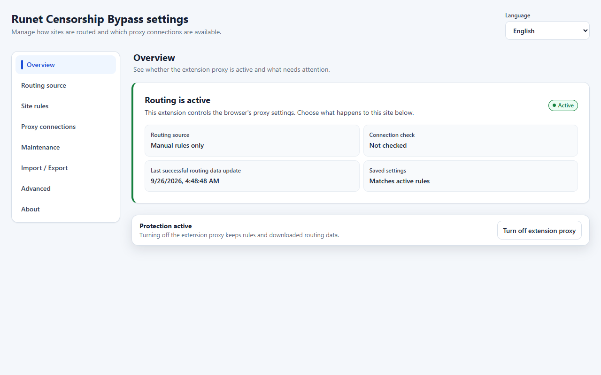

Firefox shows applied initial settings and available bundled routing data.
Data availability is not a proxy availability claim.

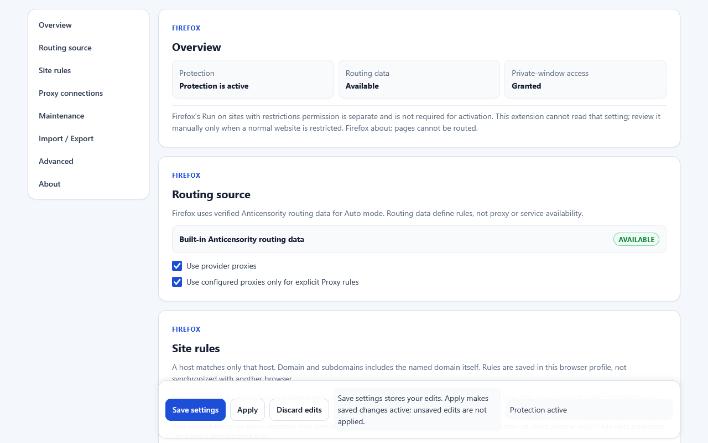

The Chromium action popup was genuinely opened by the installed extension
over an intercepted, local synthetic `news.example` page. This is the native
popup document surface, without browser toolbar chrome, not a standalone page.

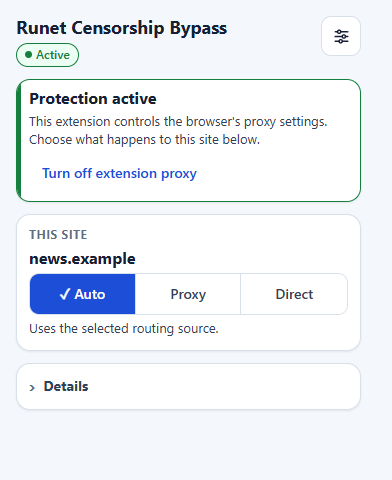

### Saved but not applied

Only `news.example`, exact-host scope, Direct was added and saved. Previous
settings remain active; the pending category is only Site rules changed.

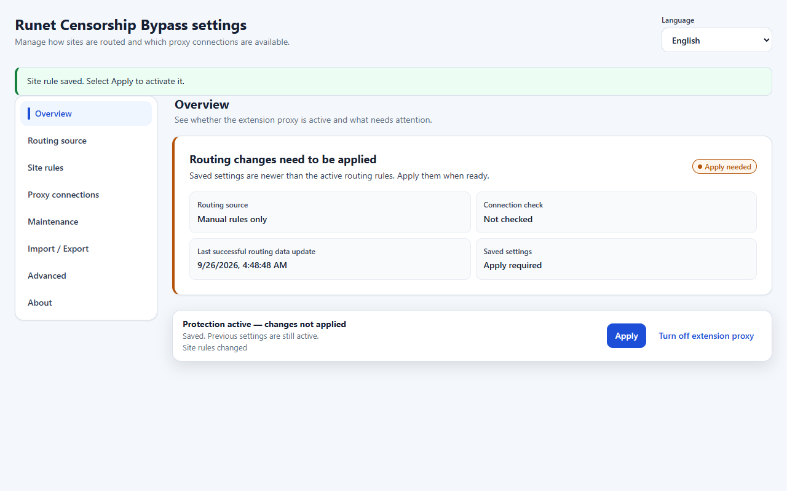

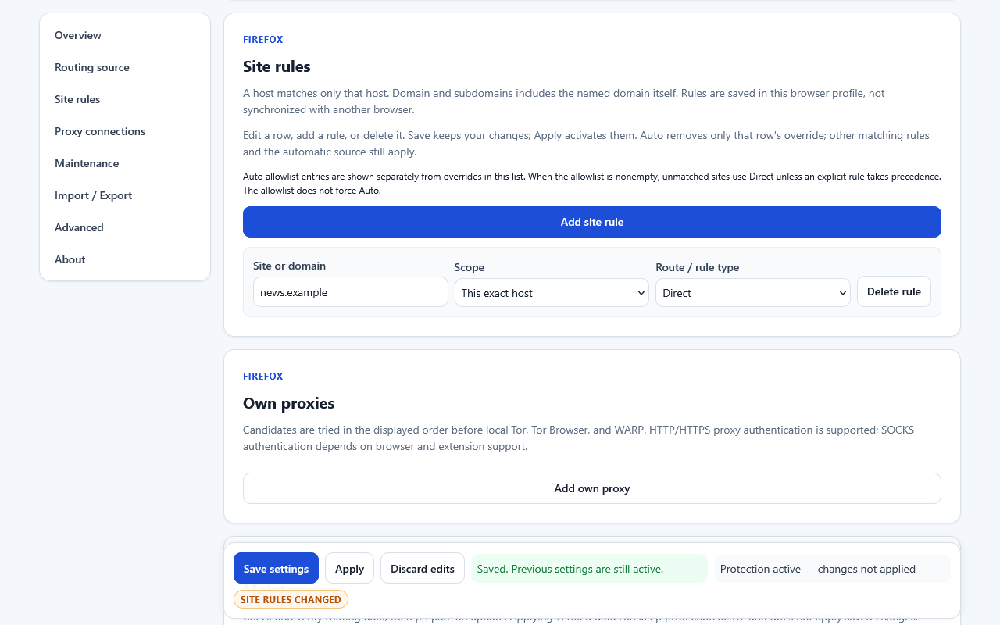

### Popup draft and Apply-all confirmation

The first genuine Chromium popup shows a local Auto-to-Direct draft, using the
popup's default domain-and-subdomains scope. Apply has not been clicked.

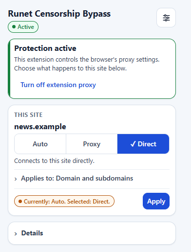

The second shows the warning and explicit Apply all saved changes choice
when Saved differs from Effective. It is the existing confirmation control,
before activation, not an invented modal. Captures preserve the native popup
viewport; lower Details content can be outside that viewport.

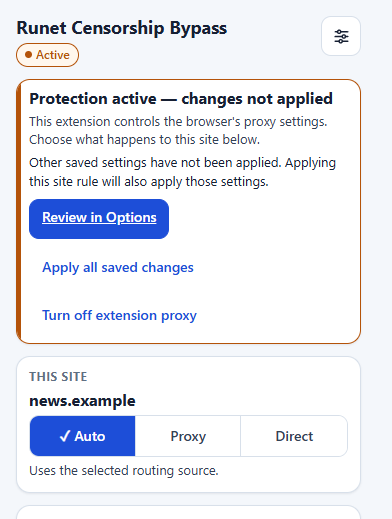

### Firefox private-window onboarding

A separate fresh profile has not granted private-window access. Protection
is off and Apply is unavailable. This is the real onboarding screen.

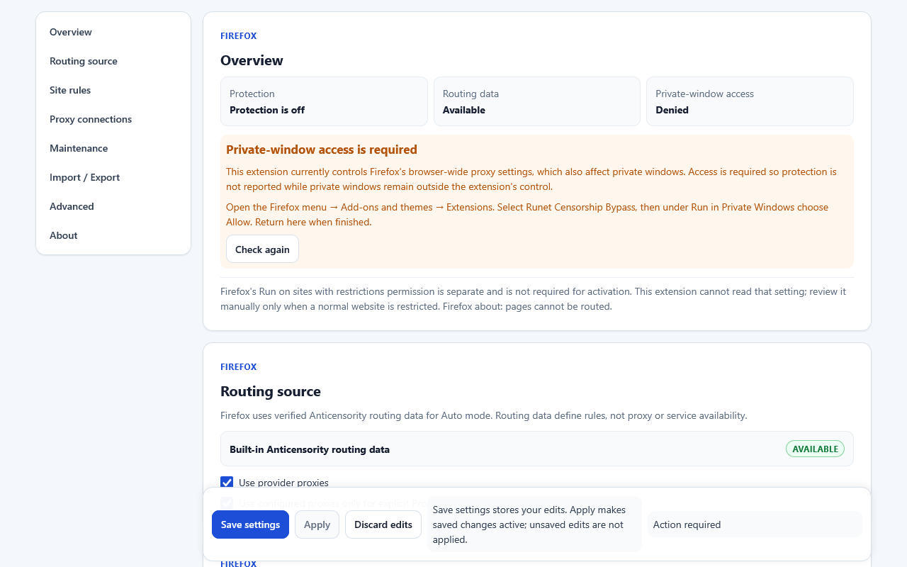

### Import preview

Both previews are unconfirmed. The synthetic transfer has two rules and five
proxy profiles, including `proxy.example:8080` with a missing credential; no
username or password is supplied. Import does not activate protection.
Firefox's native file-input control retains the installed browser's Russian
localization while extension text is English. No filenames or paths appear.

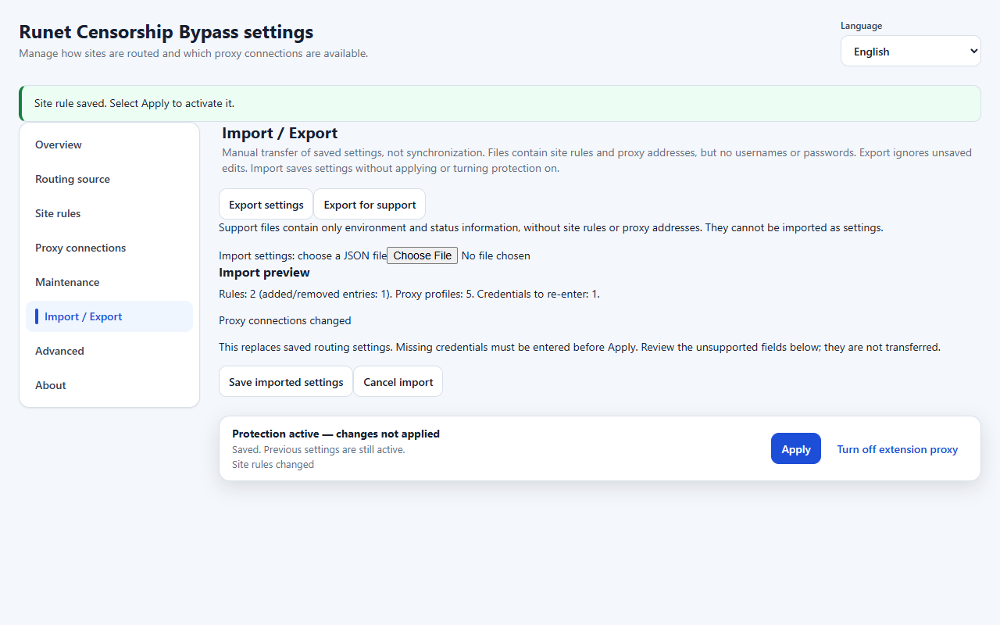

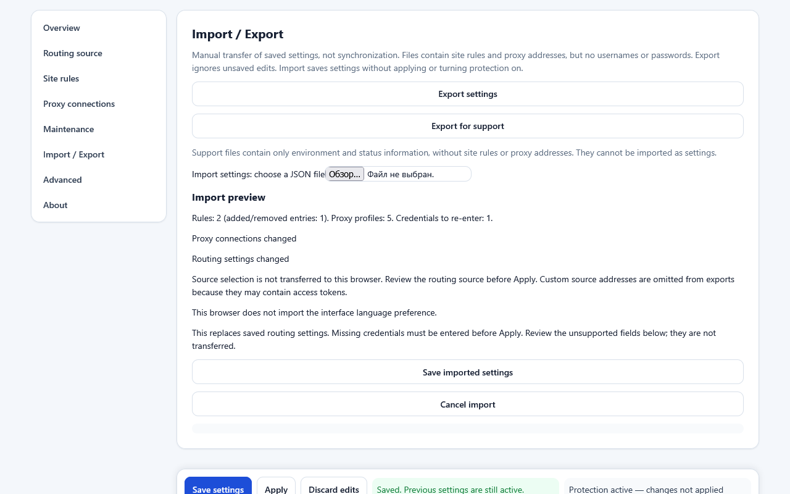

### Provider and routing-data status

Chrome shows the selected Manual rules only source and the available built-in
choices. Firefox truthfully shows bundled data with remote updates not
configured; neither image claims a working external proxy.

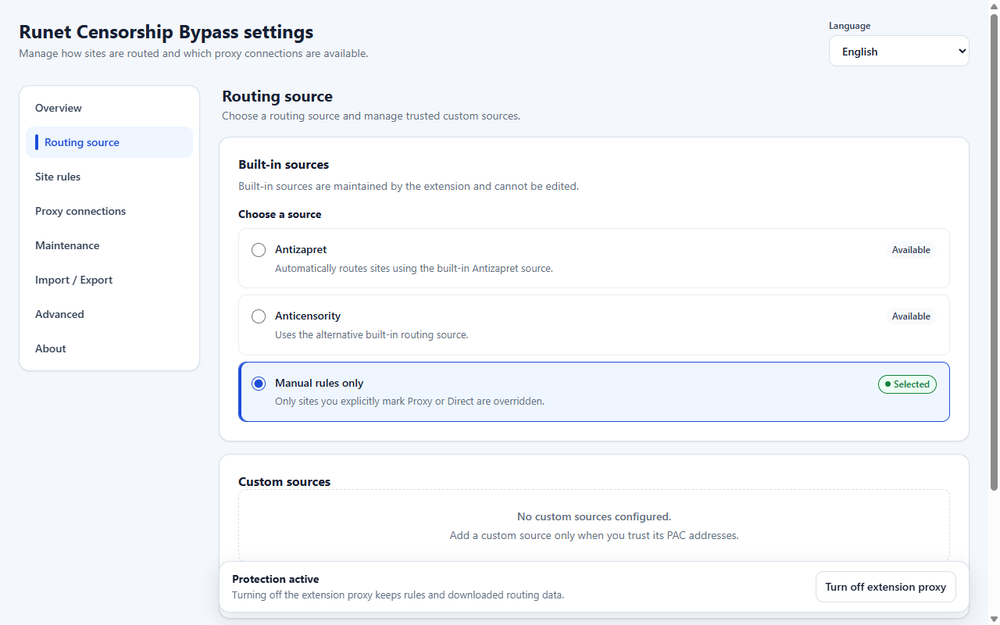

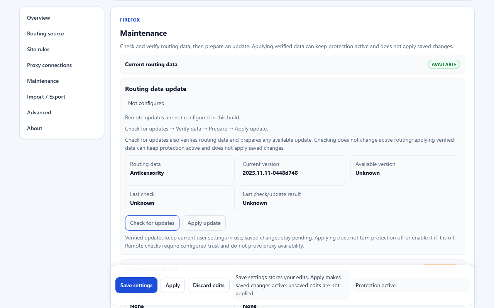

### Optional proxy connections

Default loopback examples are disabled. There is no personal or live proxy
configuration in this image.

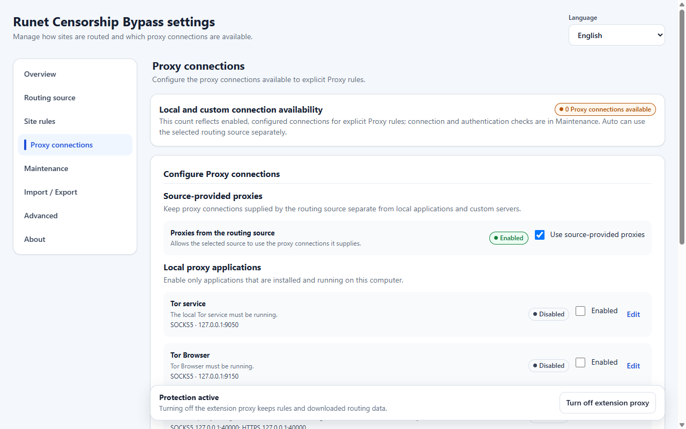

## Promotional artwork

The [440x280 PNG](chromium/promo-440x280.png) uses the existing repository shield
and an original vector routing-line background. It is branded artwork, not a
product screenshot. The editable [SVG source](chromium/promo-tile.svg) references
the unchanged runtime icon; export embeds that icon for raster rendering.


## Regression gate

All checks passed before screenshots were created, using fresh isolated
profiles and the installed Firefox 156.0.1 production browser. See the
[machine-readable results](regression-results.json).

- **Status synchronization:** external production-RPC Apply completed while
  Options stayed open. Protection became active, Applying cleared, and
  controls recovered without reload. With unsaved edits, the same form/input
  nodes and values survived; the dirty draft and Save remained available,
  while Apply stayed disabled until that draft is resolved.
- **Metadata layout:** Maintenance / Routing data update, Connection health,
  and Diagnostics passed in EN and RU at 1280x800 and 700x800, DPR 1. All 16
  label/value pairs per combination stayed grouped and ordered, with no
  measured element overflow or horizontal clipping. Page scroll width matched
  viewport width. These were live DOM/layout assertions, not snapshot-only tests.
- **Pending categories:** initial Apply, then Save-only `news.example` Direct
  exact-host produced only `siteRules` / Site rules changed, with Effective
  unchanged. A subsequent synthetic endpoint change to `127.0.0.1:19050`
  additionally produced `proxyConnections` / Proxy connections changed.
  This positive case tested an endpoint change, not real authentication.

## Provenance, privacy and validation

[Provenance](provenance.json) records every image's SHA-256, browser/version,
locale, viewport, DPR, state, synthetic inputs, capture time, and native/non-native
classification. Browser screenshot APIs captured genuine installed-extension
documents, with no UI mocks, retouching, compositing, or runtime modifications.

Every final image was visually inspected. No usernames, emails, machine paths,
credentials, tokens, personal domains, real proxy data, browsing history,
bookmarks, unrelated extensions, or notifications were found. Examples use
reserved domains and default or synthetic loopback endpoints only. Local
profiles, capture helpers and raw logs are not part of these assets.

Run from the repository root:

```powershell
node .\docs\assets\store\validate.mjs --packages
node .\scripts\verify-docs.mjs
git diff --check
```

The asset validator checks the complete PNG inventory, dimensions, hashes,
non-text PNG chunks, provenance, regression evidence and exclusion from both
existing production package trees. `--packages` requires those builds to exist;
it does not build or modify them. Source/package integrity was also checked with
the existing Chromium and Firefox package verifiers (71 files per target).
Full runtime suites are not the local gate for this documentation-only change.

## Remaining manual work before 1.0

Firefox native popup: **manual pre-release capture required**.
`browser.action.openPopup()` resolved, but native panels remained closed and
zero-sized; the Windows native automation bridge was unavailable. No Firefox
popup image was fabricated or substituted with standalone HTML. The valid
Firefox Options assets remain usable.

Before release/submission, capture that genuine Firefox popup manually, inspect
it for privacy, and record its provenance. Review these assets against the
eventual release build and recapture anything whose visible UI/version changed.
Confirm captions, store-specific listing choices and current upload rules.
Signing, version changes, release creation and store submission are outside
this visual milestone.
