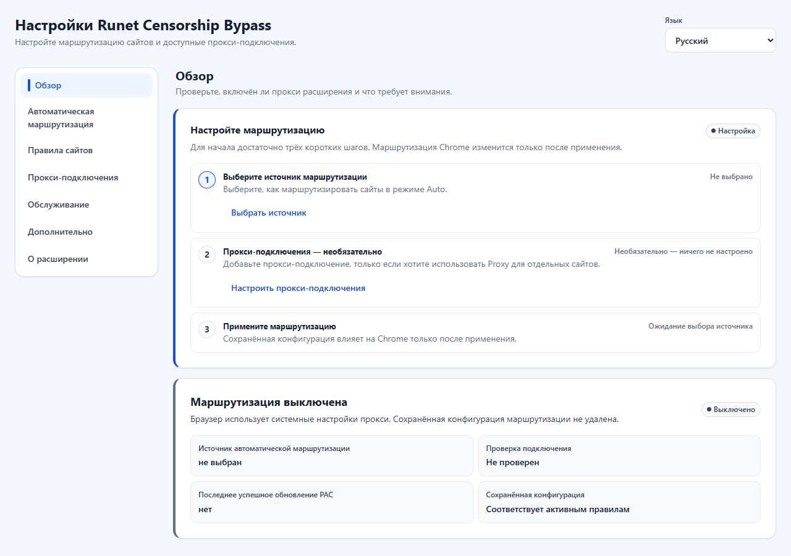
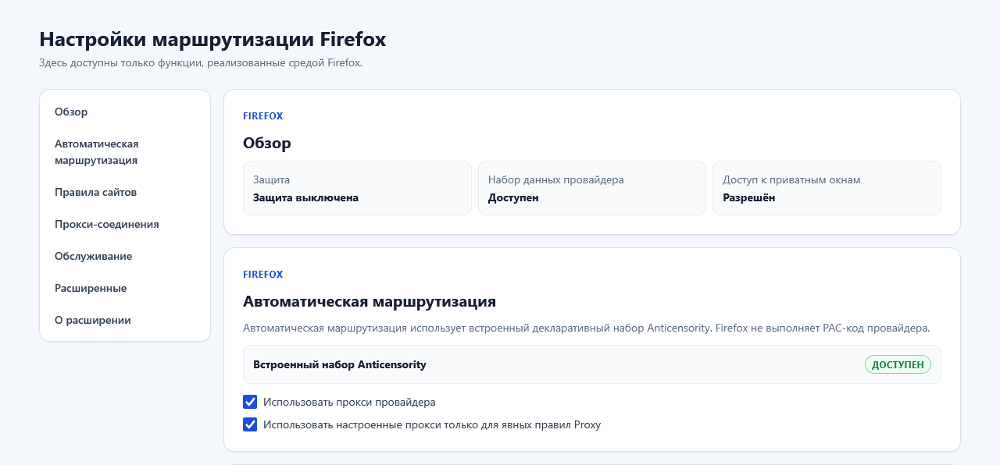

# Руководство пользователя

Runet Censorship Bypass выбирает маршрут сайта, но не предоставляет собственный
VPN или прокси. Панель у значка нужна для повседневного выбора режима текущего
сайта, а страница настроек — для источника правил и подключений.

Опубликованный [`v0.0.4.0`](https://github.com/aVitomin/runet-censorship-bypass-mv3/releases/tag/v0.0.4.0) —
первый общий выпуск Chromium и Firefox. Общие понятия одинаковы, но сохранение
и применение настроек в двух браузерах различаются.

Запомните четыре разных шага:

1. **Настроить** — выбрать источник, правило или подключение.
2. **Сохранить** — записать изменение в настройках расширения.
3. **Применить / включить** — передать подготовленные правила браузеру.
4. **Активно** — расширение сейчас управляет настройкой прокси браузера.

Сохранённое изменение не обязательно уже применяется. Состояние **Не
применено / Not applied** означает, что нужно отдельно нажать кнопку
применения.

   
  Chromium: источник маршрутизации ещё не выбран.

   
  Firefox: защита выключена, встроенный набор Anticensority доступен.

## 1. Первая настройка

### Chromium

1. Если панель показывает **Требуется настройка**, откройте страницу настроек.
2. В разделе **Автоматическая маршрутизация** выберите источник:
   - **Antizapret** или **Anticensority** загружают правила PAC этого источника;
   - **Только ручные правила** не добавляет автоматические прокси-маршруты;
   - пользовательский источник используйте только если доверяете его владельцу.
3. Выбор источника сохраняется как подготовленная конфигурация. Нажмите
   **Применить конфигурацию**.
4. В обзоре дождитесь **Маршрутизация включена / Активно** и убедитесь, что
   сохранённая конфигурация соответствует активным правилам.

Подключение источника и собственный прокси — разные вещи. PAC выбранного
источника сам определяет требования режима Авто. **Только ручные правила** не
добавляет автоматические прокси-маршруты. Подходящее включённое подключение
нужно для явного режима **Через прокси**.

### Firefox

1. На странице `about:addons` разрешите расширению работу в приватных окнах.
2. Встроенный локальный набор Anticensority уже выбран; произвольный PAC URL в
   Firefox не поддерживается.
3. Нажмите **Включить** или **Применить** и дождитесь состояния **Защита
   активна / Активно**.

Встроенные правила не являются прокси-сервисом. Для совпавших с набором сайтов
Firefox использует фиксированную цепочку локальных служб Anticensority, Tor
Browser и Tor. Защита может включиться без проверки каждой службы, но хотя бы
одна подходящая служба должна быть запущена, чтобы прокси-маршрут работал.

Настройки Firefox можно менять только при полностью выключенной защите:
нажмите **Выключить**, внесите изменения, нажмите **Сохранить настройки**, затем
снова **Включить**. Расширение не выключает активную защиту автоматически.

## 2. Панель и ежедневное использование

Откройте нужную вкладку и нажмите значок расширения. Панель показывает
глобальное состояние, текущий сайт, выбор маршрута и область правила.

1. компактное глобальное состояние;
2. имя текущего сайта;
3. **Авто / Прокси / Напрямую**;
4. свёрнутые подробности и вторичные действия.

### Авто, Прокси и Напрямую

- **Авто / Auto** удаляет явное исключение для выбранной области. Дальше
  решение принимает источник автоматической маршрутизации.
- **Через прокси / Proxy** создаёт явное правило и использует настроенные
  подключения. Если пригодного подключения нет, применить правило нельзя.
  Результат источника и намеренное прямое соединение в этот маршрут не
  добавляются.
- **Напрямую / Direct** создаёт явное правило, которое обходит прокси
  расширения для выбранной области. Это не режим повышенной приватности.

**Точный хост** действует только на показанное имя, например
`shop.example.com`. **Домен и поддомены** действует на `example.com` и все его
поддомены. Для IP-адреса, `localhost` и имени без подходящего домена доступен
только точный хост. Явное правило Напрямую имеет приоритет над правилом Прокси;
при отсутствии явного правила действует Авто.

В Chromium изменённое правило получает отметку **Не применено**: нажмите
**Применить**. В Firefox сначала выключите защиту, измените и сохраните правило,
затем снова включите её. После успешного применения обновите вкладку, чтобы
повторить уже начатые запросы.

### Глобальное состояние

- **Активно / Active** — расширение управляет настройкой прокси браузера.
- **Выкл. / Off** — управление намеренно выключено; правила и загруженные данные
  сохранены.
- **Требуется настройка / Setup required** — ещё нет пригодной конфигурации;
  это не то же самое, что намеренное выключение.
- **Внешнее управление / EXT** — настройкой владеет другое расширение или
  политика; Runet Censorship Bypass не перехватывает управление.
- **…** — операция ещё выполняется.
- **!** — требуется открыть подробности или настройки.

Значок панели использует ту же модель: **A**, **P** и **D** означают маршрут
Авто, Прокси и Напрямую текущего сайта; **OFF** — маршрутизация выключена;
**EXT** — настройкой прокси управляет другой владелец; **…** — операция идёт;
**!** — требуется внимание. Значок не является доказательством маршрута каждого
вспомогательного запроса страницы.

**Выключить прокси расширения** в Chromium или **Выключить** в Firefox
возвращает исходный слой прокси, если расширение владеет настройкой. Сохранённые
правила и данные при этом не удаляются.

## 3. Автоматическая маршрутизация

Этот раздел отвечает за правила режима Авто. Сам набор правил и доступное
прокси-подключение — разные части системы.

### Встроенные источники

В Chromium доступны:

- **Antizapret** — загружаемый PAC-файл содержит правила и прокси-маршруты
  источника; требования к соединению задаёт текущее содержимое этого файла;
- **Anticensority** — загружаемый PAC-файл определяет маршруты и свою цепочку
  подключений, которая может рассчитывать на локальные службы;
- **Только ручные правила** — автоматических прокси-маршрутов нет; для явного
  режима Прокси нужно настроить подключение;
- доверенный пользовательский PAC — требования определяет его содержимое.

Firefox использует включённый в пакет декларативный набор Anticensority и не
исполняет PAC-код. Для совпавших сайтов его фиксированная цепочка пробует
локальные службы Anticensority на портах 18611, 18613, 18615, 18617 и 18619,
затем Tor Browser на 9150 и Tor на 9050. Расширение не устанавливает эти
службы. Если ни одна недоступна, Firefox завершает запрос вместо прямого
соединения.

В Chromium выберите источник в списке, дождитесь сообщения **Источник
сохранён**, затем нажмите **Применить конфигурацию**, чтобы сделать
подготовленную конфигурацию активной.

### Пользовательский источник

Этот подраздел относится только к Chromium. Firefox использует проверенный
локальный набор и не принимает произвольный PAC URL.

Добавляйте пользовательский источник только если доверяете его владельцу и
точным адресам. Разрешены HTTPS и HTTP для локального адреса компьютера
(например, `127.0.0.1`); URL с логином или паролем отклоняется. Перенаправление
проверяется повторно. Не публикуйте частный URL, строку запроса или содержимое
источника в отчёте о проблеме.

Ошибка загрузки не означает, что предыдущие активные данные обновились.
Проверяйте обзор и раздел обслуживания после применения.

## 4. Правила сайтов

Здесь собраны все явные правила Прокси и Напрямую.

- Простая запись, например `shop.example.com`, относится только к этому хосту.
- Запись `*.example.com` включает сам `example.com` и его поддомены.
- Публичная зона вроде `.com` не может стать пользовательской областью.
- После удаления правила сайт вернётся в Авто только после применения.
- Порядок приоритетов: явное Напрямую, явный Прокси, затем решение Авто.

В Chromium сохраните изменение и используйте общую кнопку применения. В
Firefox защита должна быть выключена: сохраните настройки и затем снова
включите её. Отдельного автоматического применения для правил сайтов нет.

## 5. Прокси-подключения

Расширение поддерживает HTTP, HTTPS, SOCKS4 и SOCKS5, но не выдаёт сервер,
учётную запись или VPN-подписку. Перед настройкой получите адрес, порт и при
необходимости логин с паролем у доверенного владельца подключения.

### Добавить собственный прокси в Chromium

1. Откройте **Прокси-подключения** и выберите **Добавить пользовательский
   прокси-сервер**.
2. Укажите тип, хост и порт; при необходимости настройте аутентификацию.
3. Включите подключение и нажмите **Сохранить настройки прокси**.
4. Для нужного сайта выберите **Через прокси**.
5. Нажмите **Применить** или общую кнопку **Применить конфигурацию**.

### Добавить собственный прокси в Firefox

1. Если защита активна, нажмите **Выключить**.
2. Откройте **Прокси-соединения** и выберите **Добавить свой прокси**.
3. Укажите тип, хост, порт и при необходимости учётные данные. Включите его для
   явных правил Прокси.
4. Пока защита выключена, добавьте для нужного сайта правило **Прокси**.
5. Нажмите **Сохранить настройки**, затем **Включить** или **Применить**.

Порядок собственных прокси задаёт порядок попыток. Перемещение или удаление
подключения тоже нужно сохранить и применить.

### Подключения источника и локальные приложения

**Прокси от источника / Source-provided proxies** разрешает источнику Авто
использовать его собственную цепочку. Этот переключатель не создаёт и не меняет
ваши серверы.

- **Tor** обычно использует SOCKS5 `127.0.0.1:9050`; служба Tor должна быть
  запущена.
- **Tor Browser** обычно использует SOCKS5 `127.0.0.1:9150`; Tor Browser должен
  быть открыт.
- **WARP** рассматривается как локальный прокси. В Chromium исходное значение —
  `SOCKS5 127.0.0.1:40000; HTTPS 127.0.0.1:40000`; соответствующий локальный
  процесс должен быть запущен.

Расширение не запускает эти приложения, не ищет другой порт автоматически и не
доказывает доступность подключения только по флагу «Включено».

### Пароль и аутентификация

После сохранения пароль не показывается снова. Интерфейс сообщает только,
настроена ли аутентификация. Для замены или удаления пароля используйте явное
действие; пустое поле само по себе не раскрывает и не удаляет сохранённое
значение.

Не помещайте реальный логин, пароль или частный адрес прокси в снимок экрана или
публичный отчёт. Успешная **Проверка подключения** и успешная аутентификация —
разные результаты.

Редкие правила замены режима Напрямую и удаления его резервного варианта
находятся в расширенных настройках. Обычная установка их не требует.

## 6. Обслуживание

Раздел **Обслуживание / Maintenance** содержит:

- обновление данных автоматической маршрутизации;
- расписание периодического обновления;
- ручную **Проверку подключения**;
- очищенные события и диагностический отчёт.

В Chromium доступность обновления данных зависит от выбранного источника. Это
не обновляет само расширение и не включает выключенную маршрутизацию.

Firefox `0.0.4.0` использует проверенный набор, включённый в XPI. Адрес и ключ
удалённого канала ещё не настроены, поэтому **Проверить обновления** показывает
**Не настроено**, а ручная и фоновая загрузка отключены. Встроенный набор при
этом продолжает работать. Обновление самого XPI выполняется отдельно.

Проверка подключения не меняет Авто / Прокси / Напрямую, не включает
маршрутизацию и не применяет настройки. Успешный ответ
подтверждает только проверенный путь; он не доказывает анонимность, отсутствие
DNS-утечек, маршрут всех запросов или успешную аутентификацию каждого соединения.

Не публикуйте профиль браузера, NetLog, адрес прокси, URL источника со строкой
запроса, учётные данные, cookies, посещённые URL или содержимое набора правил.

## 7. Расширенные настройки

Этот раздел предназначен для редких настроек с потенциально широким действием:

- область собственных прокси-подключений;
- замена режима Напрямую и удаление его резервного варианта;
- совместимость и явная миграция старых настроек;
- экспертные операции с состоянием.

Меняйте их только если понимаете последствия. Исходные безопасные значения
ограничивают собственные подключения явными правилами, не заменяют прямое
соединение прокси и сохраняют его там, где его возвращает источник.

## 8. О программе

Раздел показывает версию расширения, ссылки текущего репозитория, лицензию и
атрибуцию исходного проекта. Текущий опубликованный выпуск — `v0.0.4.0` для
Chromium и Firefox. Для проверки опубликованного файла используйте
[инструкцию по установке](INSTALLATION.md).

## Ручной перенос настроек (новые сборки из main)

В опубликованном `v0.0.4.0` этого раздела ещё нет. В новых сборках откройте
**Импорт / Экспорт** в настройках. Это ручной перенос JSON-файла между
установками Chromium и Firefox, а не синхронизация или облачное хранилище.

**Экспорт настроек** сохраняет правила, их область действия, порядок и параметры
прокси, параметры маршрутизации и поддерживаемый выбор источника. Экспортируются
сохранённые значения, а не несохранённые правки. Логины, пароли, журналы,
действующее состояние подключения и PAC не переносятся. Адреса собственных
источников также исключены: они могут содержать токены. Сам файл настроек всё
равно содержит адреса прокси и правила сайтов — не публикуйте его.

Для импорта выберите JSON-файл (до 1 МиБ), проверьте предварительный просмотр и
предупреждения о неподдерживаемых полях, затем нажмите **Сохранить импортированные
настройки**. Текущие сохранённые настройки будут заменены. Сначала сохраните или
отмените несохранённые правки; изменения из другого окна не перезаписываются
молча. Неподдерживаемые возможности не появляются от импорта: например, Firefox
сохраняет свой встроенный источник, а отключённые правила Chromium в Firefox не
переносятся. Проверьте предупреждения до подтверждения.

Импорт **не применяет настройки и не включает защиту**. Уже действующая
конфигурация продолжает работать. Введите недостающие учётные данные в разделе
прокси (либо явно выберите работу без авторизации, если она не нужна), сохраните
их и отдельно нажмите **Применить**. Для включённых профилей с отметкой о
недостающих данных применение заблокировано; старые пароли не подбираются по
адресу прокси. Авто означает отсутствие явного переопределения, а не режим
Напрямую или гарантию доступности.

**Экспорт для поддержки** создаёт отдельный файл только с версией браузера и
расширения, языком, платформой и кратким состоянием. В нём нет правил сайтов,
адресов прокси, истории, cookies или сетевых журналов. Это не файл настроек;
его нельзя импортировать. Дополнительных запросов или загрузки источников при
импорте не выполняется.

### Manual transfer — English

New builds from main add **Import / Export** in Options; this is not part of the
published `v0.0.4.0`. Settings exports transfer saved configuration manually,
without cloud synchronization, usernames, passwords or runtime state. Custom
source URLs are omitted because they may contain tokens. Settings files still
contain site rules and proxy addresses: keep them private. Review unsupported
fields before confirming an import. Import only saves a new configuration; it
never activates protection or changes the active configuration. Re-enter missing
credentials and explicitly Apply later. **Export for support** contains only
sanitized environment/status information, not configuration, and cannot be
imported as settings.

## Если что-то не работает

Начните с обзора: он различает незавершённую настройку, намеренное выключение,
неприменённое изменение и внешнего владельца. Затем откройте обслуживание только
для соответствующей проверки. Пошаговые действия собраны в
[руководстве по решению проблем](TROUBLESHOOTING.md).

## English summary

The extension selects routes but does not provide a VPN or proxy service.
**Auto** follows the selected source, **Proxy** requires an enabled configured
connection, and **Direct** bypasses the extension proxy for the selected exact
host or domain scope. Saving and applying are separate: Chromium uses **Save**
then **Apply configuration**; Firefox settings are editable only while
protection is fully off, followed by **Save settings** and **Enable**. Firefox's
packaged Anticensority rules expect compatible local Anticensority/Tor services,
which the extension does not start.
